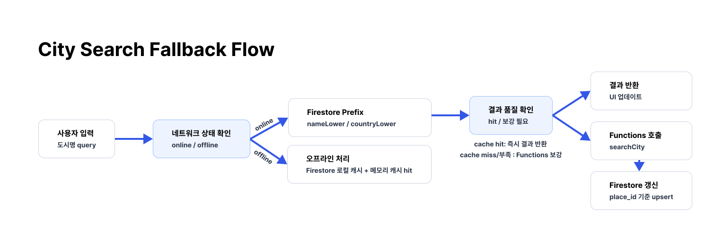
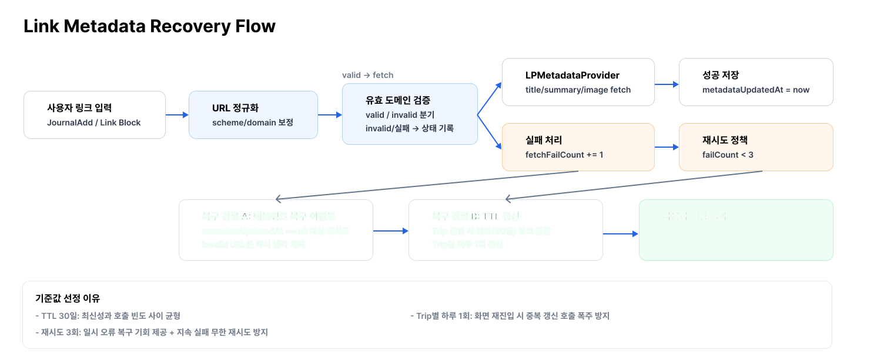
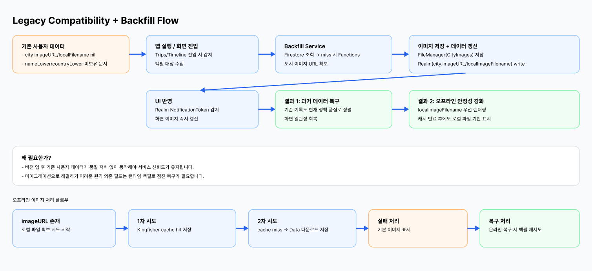
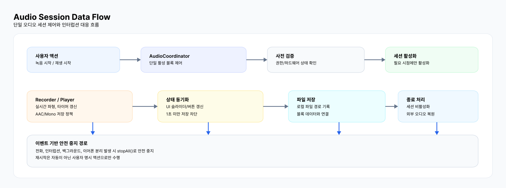

<h1 style="display: flex; align-items: center; gap: 8px;">
  
  TripRoad
</h1>

 

## 1. 한 줄 소개
`여행의 순간을 텍스트·링크·사진·음성으로 기록하고, 타임라인으로 다시 돌아보는 여행 기록 앱`

## 2. 주요 기능
**🧭 여행 카드 생성**  
교통수단·일정·출발/도착지 입력

**🔎 도시 검색 최적화**  
Firestore 캐시 우선 + Functions 보강

**📝 블록형 여행 기록**  
텍스트·링크·사진·음성 블록 구성

**📅 타임라인 조회**  
날짜 기준 여행 기록 그룹화

**🔗 링크 미리보기**  
URL 정규화 + 메타데이터 자동 추출 + 링크 이동

**🖼️ 커스텀 사진 선택기**  
저화질→고화질 2단계 로딩 + 페이지네이션 + 다중 선택 최적화

**🎙️ 음성 메모**  
녹음/재생 + 단일 오디오 세션 관리 + 인터럽션/라우트 변경 대응

**📴 오프라인 대응**  
로컬 저장 + 네트워크 복구 시 자동 보정

## 3. 스크린샷
<table>
  <tr>
    <td align="center" width="25%">여행 목록 화면</td>
    <td align="center" width="25%">여행지 설정 화면</td>
    <td align="center" width="25%">여행 기록 목록 화면</td>
    <td align="center" width="25%">여행 기록 작성 화면</td>
  </tr>
  <tr>
    <td align="center"></td>
    <td align="center"></td>
    <td align="center"></td>
    <td align="center"></td>
  </tr>
</table>

## 4. 기술 스택
| Category | Stack | Version |
| --- | --- | --- |
| App Target |  | iOS Deployment Target `16.0+` |
| Language |  | Swift `5` |
| UI |   | SnapKit `5.7.1` |
| Reactive |   | RxSwift/RxCocoa `6.10.1` |
| Local DB |  | RealmSwift `20.0.3` |
| Backend |   | firebase-ios-sdk `12.9.0` |
| Media / Image |    | Kingfisher `8.7.0` |
| UX / Utility |    | FSCalendar `2.8.4`, Toast-Swift `5.1.1`, IQKeyboardManager `8.0.2` |
| Functions Runtime |   | Node.js `24`, TypeScript `5.7.3`, firebase-functions `7.0.0` |

## 5. 아키텍처 설명
- 패턴: MVVM + Clean Architecture
- 레이어: `Presentation` / `Domain` / `Data`
- 핵심: UseCase 중심 의존성 분리 + Local(Realm) 우선 + Remote(Firebase) 보강

### Architecture DFD

## 6. 핵심 기술 포인트
### 1) 도시 검색 하이브리드 구조
- 기술 목표: 검색 속도/정확도/API 비용 균형
- 설계/구현: Firestore prefix 1차 검색, miss 시 Functions fallback, `place_id` 기준 저장
- 핵심 포인트: cache-first 파이프라인으로 원격 호출 최소화

### 2) 링크 미리보기 파이프라인
- 기술 목표: 링크를 구조화된 미리보기 데이터로 저장/재사용
- 설계/구현: URL 정규화 -> 메타데이터 추출 -> 이미지/메타데이터 로컬 저장
- 핵심 포인트: TTL 기반 갱신 + 실패 재시도 제한 + 오프라인 복구 경로 설계

### 3) 도시 이미지 백필 + 로컬 우선 렌더링
- 기술 목표: 과거 데이터/오프라인에서도 이미지 표시 일관성 유지
- 설계/구현: BackfillService로 원격 보강 후 로컬 파일 저장 및 Realm 갱신
- 핵심 포인트: `localImageFilename` 우선 렌더링으로 네트워크 의존도 축소

### 4) 커스텀 사진 선택기
- 기술 목표: 대량 사진 환경에서 초기 체감 속도와 스크롤 안정성 확보
- 설계/구현: 페이지네이션, 증분 렌더링, 저화질->고화질 2단계 로딩, 썸네일 캐싱
- 핵심 포인트: 비동기 로딩과 화면 갱신 분리로 UI 부하 완화

### 5) 음성 메모 안정화
- 기술 목표: 시스템 이벤트 상황에서도 녹음/재생 상태 안정성 확보
- 설계/구현: `AudioCoordinator` 단일 세션 제어 + 인터럽션/라우트 변경 대응
- 핵심 포인트: 오디오 세션 생명주기 명시적 제어로 블록 간 충돌 방지

## 7. 고민한 점 (설계 의사결정)
### 1) 도시 검색 Fallback 설계

**배경**  
- 도시 검색은 `응답 속도`, `정확도`, `외부 API 비용`을 동시에 만족해야 했고, 오프라인에서도 최소 동작이 필요했습니다.

**선택한 구조**  
- `Firestore prefix cache-first -> miss 시 Functions fallback -> Google Places 정제 -> Firestore 재적재` 흐름으로 설계했습니다.

**운영 규칙**  
- 오프라인: 원격 호출 없이 Firestore 로컬 캐시(및 단기 메모리 캐시 hit) 결과만 사용  
- 온라인: 캐시 결과를 우선 반환하고 부족할 때만 Functions로 보강  
- 1글자 입력 원격 호출 제한 + `place_id` 기준 식별 일관성 유지

**효과**  
- 검색 초기 체감 속도를 유지하면서도, 호출 비용과 중복/오탐 데이터 유입을 함께 줄일 수 있었습니다.

### 2) 링크 메타데이터 복구 경로

**배경**  
- 링크 미리보기는 오프라인, 일시적 네트워크 오류, 잘못된 URL 입력에서 누락/반복 요청 문제가 쉽게 발생했습니다.

**선택한 구조**  
- 실패를 상태로 저장(`metadataUpdatedAt`, `fetchFailCount`)하고, 즉시 처리 경로와 복구 경로를 분리했습니다.

**운영 규칙**  
- URL 유효 + 네트워크 가능: 즉시 fetch 후 저장  
- URL 유효 + 실패: 실패 카운트 누적 후 복구 대상화  
- URL 무효: 과도한 재시도 방지를 위한 냉각 처리  
- 복구 A: 네트워크 복구 시 `metadataUpdatedAt == nil` 우선 재시도  
- 복구 B: TTL 만료 링크를 Trip별 하루 1회 갱신

**기준값 선정 이유**  
- TTL 30일: 메타데이터 최신성과 호출 빈도의 균형  
- 재시도 3회: 일시 오류 복구 기회 확보 + 무한 재시도 방지  
- Trip별 하루 1회: 화면 재진입 시 중복 갱신 폭주 방지

### 3) 과거 데이터 호환성

**배경**  
- 스키마/정책 변경 이후, 기존 데이터의 누락 필드 때문에 검색 결과 품질과 도시 이미지 표시 일관성이 깨질 수 있었습니다.

**핵심 대상**  
- 검색: `nameLower/countryLower`가 없는 legacy 도시 문서  
- 이미지: `imageURL/localImageFilename`이 비어 있는 과거 Trip/City 데이터

**선택한 구조**  
- 검색은 하위호환 조회 경로를 병행하고, 이미지는 `CityImageBackfillService`로 원격 보강 후 로컬 파일 + Realm에 재기록했습니다.  
- UI는 Realm `NotificationToken` 기반 실시간 변경 감지로 즉시 반영하도록 구성했습니다.

**네트워크 상태 분기**  
- 온라인: Firestore 조회 -> miss 시 Functions fallback -> 로컬 파일 저장/Realm 갱신  
- 오프라인: 기존 로컬 데이터 유지 표시 -> 온라인 복구 시 백필 재시도

**오프라인 이미지 처리 순서**  
- `imageURL` 존재 시 로컬 파일 확보 시도  
- 1차: Kingfisher cache hit 이미지 저장 시도  
- 2차: cache miss 시 URL `Data(contentsOf:)` 다운로드 저장 시도  
- 모두 실패 시 기본 이미지 표시, 이후 온라인 복구 시 백필 재시도

**효과**  
- 파이프라인은 다소 복잡해졌지만, 과거 데이터에서도 화면 품질을 안정적으로 유지할 수 있었습니다.

### 4) 오디오 세션 안정성

**배경**  
- 음성 메모 기능은 단순 녹음 구현보다, `전화/음악/백그라운드/이어폰 분리` 같은 시스템 이벤트에서의 안정성이 핵심이었습니다.  
특히 여러 음성 블록이 공존하는 타임라인 화면에서는 세션 충돌이 UX 저하로 바로 이어졌습니다.

**선택한 구조**  
- `AudioCoordinator` 중심 단일 세션 제어 구조를 채택하고, 세션 활성화 시점을 최소화했습니다.

**핵심 정책**  
- 단일 활성 규칙: 한 블록에서 녹음/재생 시작 시 다른 블록 작업은 중지  
- 인터럽션 대응: 전화, 오디오 인터럽션, 백그라운드 진입 시 `stopAll()`로 안전 중지  
- 라우트 변경 대응: 이어폰 분리 등 `routeChangeNotification` 감지 시 중지 처리  
- 세션 최소 활성화: 실제 녹음/재생 시작 시점에만 세션 활성화 (`isAudioSessionActive` 관리)  
- 외부 오디오 영향 최소화: 단순 화면 진입/길이 계산만으로는 외부 음원 중단이 일어나지 않도록 분리

**세부 고려사항**  
- 길이 계산은 `AVAudioPlayer` 대신 `AVURLAsset` 사용(불필요한 세션 활성화 방지)  
- 권한/하드웨어 예외 처리: 마이크 권한 거부, 마이크 미탑재 기기 대응  
- 저장 정책: 1초 미만 녹음은 저장하지 않음  
- 포맷 정책: AAC + 모노 + 중간 품질 기반으로 용량/품질 균형

**효과**  
- 예외 상황에서 동작 재현성이 높아졌고, 다중 블록/외부 오디오 환경에서도 녹음·재생 상태를 일관되게 유지할 수 있었습니다.
