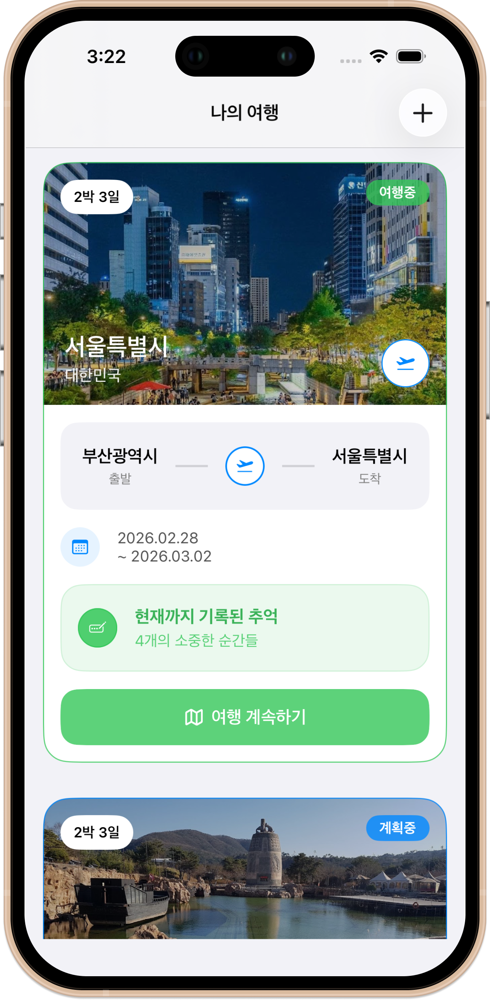
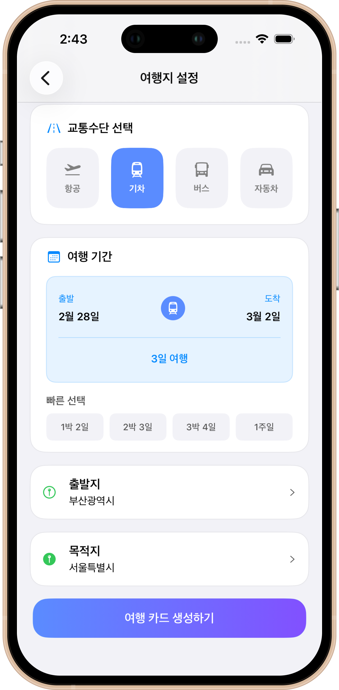
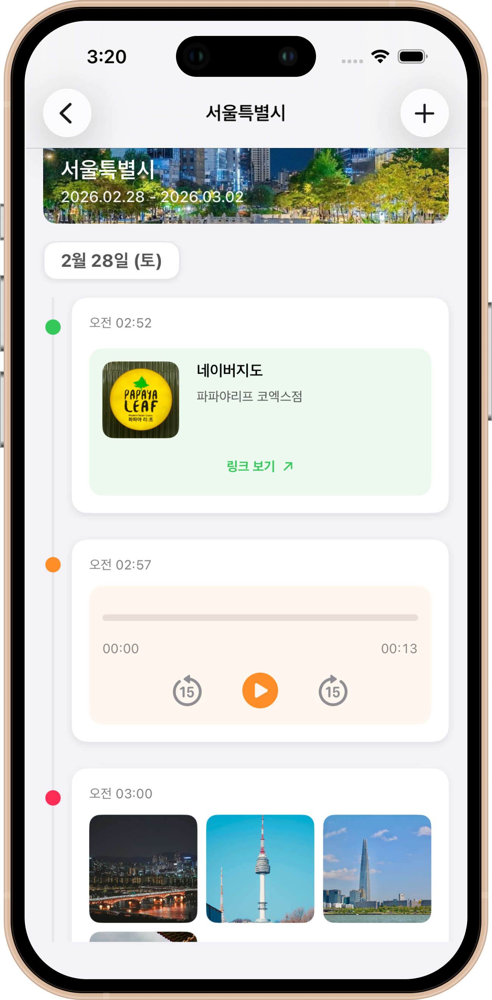
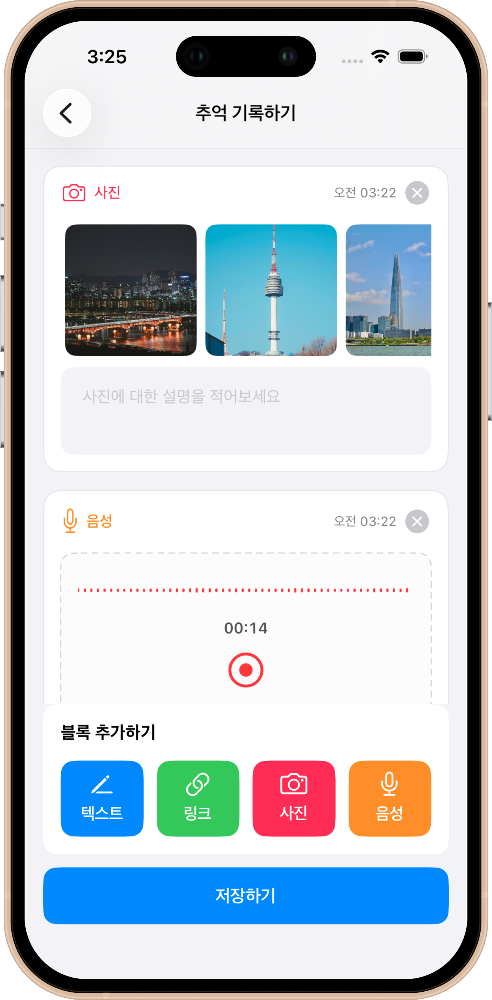
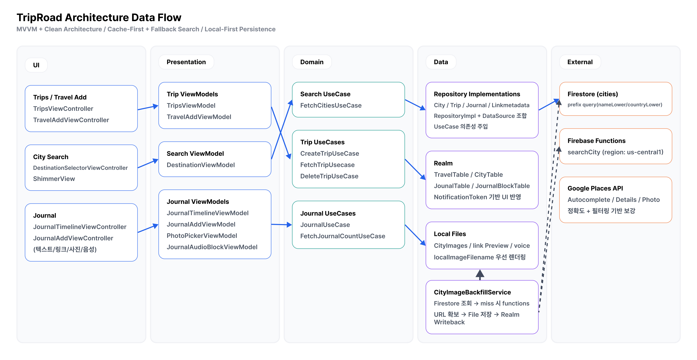

<h1 style="display: flex; align-items: center; gap: 8px;">
  
  TripRoad
</h1>

 [](https://apps.apple.com/kr/app/triproad-%EC%97%AC%ED%96%89%EC%9D%98-%EC%88%9C%EA%B0%84%EC%9D%84-%EA%B8%B0%EB%A1%9D%ED%95%98%EB%8B%A4/id6753877753)

## 1. 한 줄 소개
`여행의 순간을 텍스트·링크·사진·음성으로 기록하고, 타임라인으로 다시 돌아보는 여행 기록 앱`

## 2. 스크린샷
<table>
  <tr>
    <td align="center" width="25%">여행 목록 화면</td>
    <td align="center" width="25%">여행지 설정 화면</td>
    <td align="center" width="25%">여행 기록 목록 화면</td>
    <td align="center" width="25%">여행 기록 작성 화면</td>
  </tr>
  <tr>
    <td align="center"></td>
    <td align="center"></td>
    <td align="center"></td>
    <td align="center"></td>
  </tr>
</table>

## 3. 기술 스택
| Category | Stack | Version |
| --- | --- | --- |
| App Target |  | iOS Deployment Target `16.0`, Marketing Version `1.5.0` |
| Language |  | Swift `5.0` |
| UI |   | SnapKit `5.7.1` |
| Reactive |   | RxSwift/RxCocoa `6.10.1` |
| Local DB |  | RealmSwift `20.0.3` |
| Backend |   | firebase-ios-sdk `12.9.0` |
| Media / Image |    | Kingfisher `8.7.0` |
| UX / Utility |    | FSCalendar `2.8.4`, Toast-Swift `5.1.1`, IQKeyboardManager `8.0.2` |
| Functions Runtime |   | Node.js `24`, TypeScript `5.7.3`, firebase-functions `7.0.0` |

## 4. 아키텍처 설명
- 패턴: MVVM + Clean Architecture
- 레이어:
- `Presentation`: ViewController + ViewModel (입력/상태 관리)
- `Domain`: Entity + UseCase + Repository Protocol (비즈니스 규칙)
- `Data`: Realm Repository + Firestore/Functions DataSource (구현체)

### Architecture DFD


## 5. 핵심 기술 포인트
- 도시 검색 하이브리드 구조
- Firestore prefix 검색(`nameLower`, `countryLower`) 우선
- 캐시 miss 시 Functions `searchCity` 호출
- `place_id` 기반 저장으로 중복/무결성 개선

- 링크 미리보기 파이프라인
- URL 정규화(`https` 자동 보정 포함)
- `LPMetadataProvider`로 title/description/image 추출
- Realm + 문서 디렉토리 파일 저장

- 도시 이미지 백필(Backfill)
- 과거 데이터(`imageURL`, `localImageFilename` 누락) 자동 보정
- Firestore 조회 -> miss 시 Functions fallback -> 로컬 파일 저장 -> Realm 업데이트
- 화면은 `localImageFilename` 우선 렌더링, URL fallback

- 실시간 상태 반영
- `NWPathMonitor` 기반 네트워크 상태 감지
- Realm `NotificationToken`으로 데이터 변경 시 화면 갱신

## 6. 성능 개선
> 아래 수치는 코드에 반영된 운영 수치입니다.

- 검색 입력 제어
- debounce: `400ms`
- skeleton 셀: `5개`
- Firestore page limit: `20`
- Functions 결과 limit: 기본 `10`, 최대 `20`
- 1글자 입력은 원격 호출 제한(캐시 우선)

- 링크 메타데이터 캐시 정책
- TTL: `30일`
- 실패 재시도 상한: `3회` (`fetchFailCount < 3`)
- Trip별 TTL 갱신: `하루 1회`

- 이미지 캐시/저장 전략
- Kingfisher 메모리 캐시: `50MB`, 만료 `300초`
- Kingfisher 디스크 캐시: `200MB`, 만료 `7일`
- 장기 보존은 FileManager(`CityImages`) + Realm filename 참조

- 사진 선택기 최적화
- 페이지네이션 배치: `300개`
- `reloadData` 중심 갱신에서 `insertItems` 기반 증분 갱신으로 전환
- `AsyncStream` 저화질 -> 고화질 스트리밍 + iCloud nil 콜백 분기 처리

- 음성 처리 안정화
- 녹음 최소 길이: `1초`
- 재생 건너뛰기: `±15초`
- 타이머 업데이트 주기: `0.05초`
- 세션 충돌 시 `stopAll()`로 단일 오디오 세션 유지

## 7. 트러블슈팅
- 도시 검색 시 이상 데이터/중복 데이터 유입
- 원인: query 문자열 기반 저장, 불완전한 정규화
- 해결: `place_id` 문서 키 사용 + 도시 타입 필터링 + prefix 캐시 우선 구조

- 링크 메타데이터가 오프라인에서 누락되는 문제
- 원인: 최초 요청 실패 후 갱신 타이밍 부재
- 해결: `metadataUpdatedAt` + `fetchFailCount` + 네트워크 복구 시 재시도 경로 추가

- 과거 여행 카드/타임라인의 도시 이미지 누락
- 원인: 이전 스키마 데이터의 `imageURL/localImageFilename` 빈 값
- 해결: 백필 서비스 도입(원격 조회 -> 로컬 저장 -> Realm 갱신), Realm 변경 감지로 UI 즉시 반영

- 사진 페이지네이션 중 크래시
- 원인: 대량 로딩 시 `reloadData()` 남용
- 해결: `performBatchUpdates + insertItems`로 변경해 증분 렌더링

- 오디오 재생 시 외부 오디오와 세션 충돌
- 원인: 세션 활성/비활성 경계 불명확
- 해결: 실제 녹음/재생 시점에만 세션 활성화, 인터럽션/라우트 변경 시 안전 중지

## 8. 폴더 구조
```text
TripRoad
├─ TravelLog
│  ├─ App
│  ├─ Presentation
│  │  ├─ Base
│  │  ├─ Common
│  │  ├─ Trip
│  │  ├─ Travel
│  │  └─ Journal
│  ├─ Domain
│  │  ├─ Entity
│  │  ├─ Repository
│  │  └─ UseCase
│  └─ Data
│     ├─ DataSource
│     ├─ Repository
│     └─ Realm
├─ functions
│  └─ src/index.ts
└─ Firebase
```

## 9. 실행 방법
### iOS
1. `TravelLog.xcodeproj` 열기
2. Swift Package 의존성 Resolve
3. Firebase iOS 앱 등록 후 `GoogleService-Info.plist`를 프로젝트 루트에 추가
4. Run (iOS 16.0+)

### Firebase Functions (선택)
1. `cd functions`
2. `npm install`
3. `npm run build`
4. `npm run deploy`
5. 환경 변수 `GOOGLE_API_KEY` 설정
