<h1 style="display: flex; align-items: center; gap: 8px;">
  
  TripRoad
</h1>

 [](https://apps.apple.com/kr/app/triproad-%EC%97%AC%ED%96%89%EC%9D%98-%EC%88%9C%EA%B0%84%EC%9D%84-%EA%B8%B0%EB%A1%9D%ED%95%98%EB%8B%A4/id6753877753)

## 개발 기간
`2025.09.29 ~ 2026.03.03(지속 배포 중)`

## 목차
[1. 한 줄 소개](#1-한-줄-소개)  
[2. 주요 기능](#2-주요-기능)  
[3. 스크린샷](#3-스크린샷)  
[4. 기술 스택](#4-기술-스택)  
[5. 아키텍처 설명](#5-아키텍처-설명)  
[6. 핵심 기술 포인트](#6-핵심-기술-포인트)  
[7. 고민한 점 (설계 의사결정)](#7-고민한-점-설계-의사결정)  
[8. 트러블슈팅](#8-트러블슈팅)  

## 1. 한 줄 소개
`여행의 순간을 텍스트·링크·사진·음성으로 기록하고, 타임라인으로 다시 돌아보는 여행 기록 앱`

## 2. 주요 기능
**🧭 여행 카드 생성**  
교통수단·일정·출발/도착지 입력

**🔎 도시 검색 최적화**  
Firestore 캐시 우선 + Functions 보강

**📝 블록형 여행 기록**  
텍스트·링크·사진·음성 블록 구성

**📅 타임라인 조회**  
날짜 기준 여행 기록 그룹화

**🔗 링크 미리보기**  
URL 정규화 + 메타데이터 자동 추출 + 링크 이동

**🖼️ 커스텀 사진 선택기**  
저화질→고화질 2단계 로딩 + 페이지네이션 + 다중 선택 최적화 + 사진 미리보기

**📷 사진 촬영/앨범 반영**  
카메라 촬영 후 앨범 저장 + `PHPhotoLibraryChangeObserver` 기반 목록 즉시 반영

**🎙️ 음성 메모**  
녹음/재생 + 단일 오디오 세션 관리 + 인터럽션/라우트 변경 대응

**📴 오프라인 대응**  
로컬 저장 + 네트워크 복구 시 자동 보정

**🎫 티켓 스캔 자동 인식**  
탑승권·승차권 사진 한 장으로 교통수단·출발지·도착지·일정 자동 채움 (온디바이스 Vision + Claude API)

**🔒 개인정보 다층 보호**  
온디바이스 자동 마스킹 + 사용자 확인 + 명시적 동의 + 서버 프롬프트 제약 + 로그 마스킹

## 3. 스크린샷
[](https://www.figma.com/design/VHvp2tvYlxKmvOAORLpNIs/TripRoad?node-id=0-1&t=43wVawkOv7NGf23r-1)

<table>
  <tr>
    <td align="center" width="16.6%">여행 목록 화면</td>
    <td align="center" width="16.6%">여행지 설정 화면</td>
    <td align="center" width="16.6%">도시 선택 화면</td>
    <td align="center" width="16.6%">여행 기록 목록 화면</td>
    <td align="center" width="16.6%">여행 기록 작성 화면</td>
    <td align="center" width="16.6%">사진 선택 화면</td>
  </tr>
  <tr>
    <td align="center">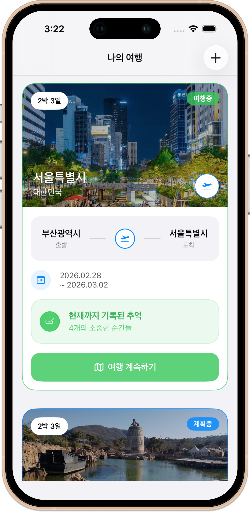</td>
    <td align="center">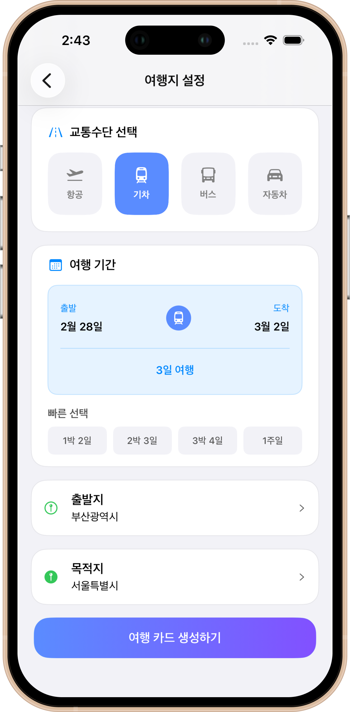</td>
    <td align="center">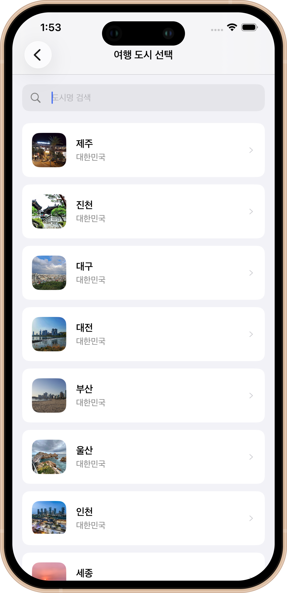</td>
    <td align="center">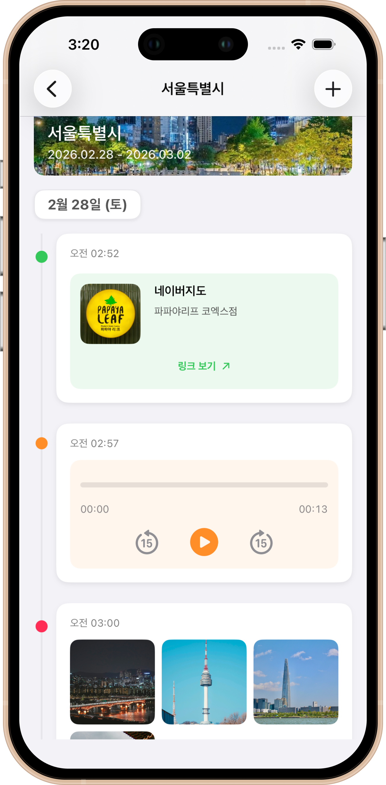</td>
    <td align="center">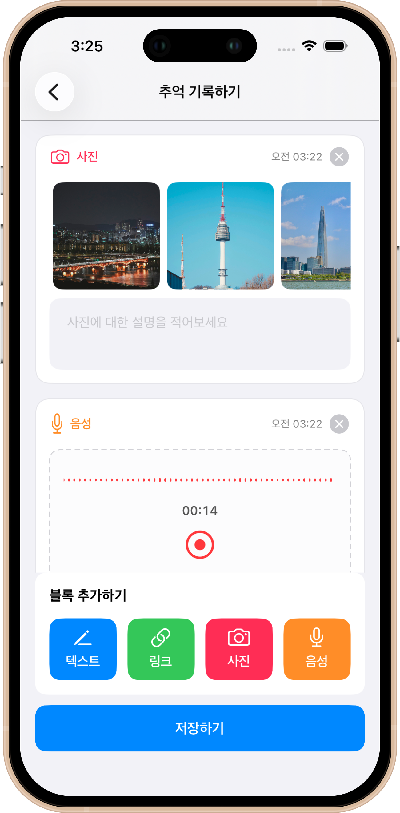</td>
    <td align="center">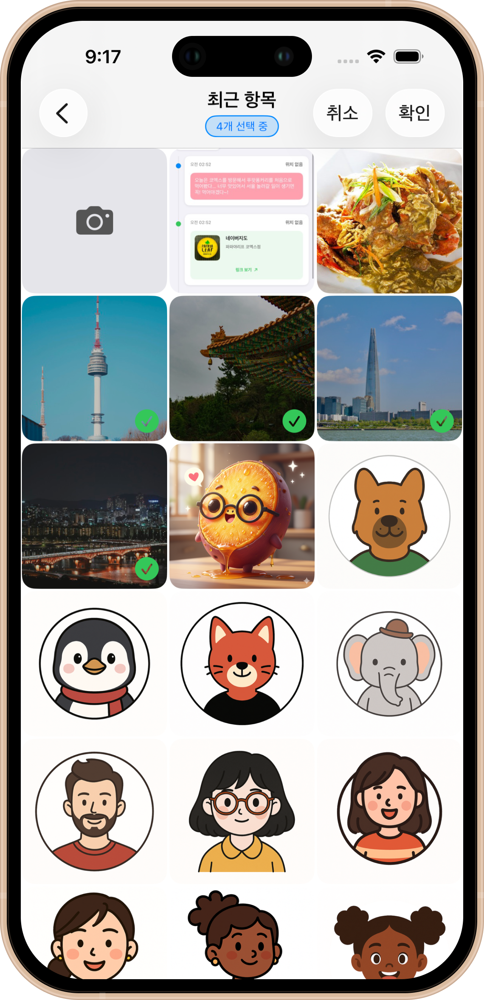</td>
  </tr>
</table>

## 4. 기술 스택
| Category | Stack | Version |
| --- | --- | --- |
| App Target |  | iOS Deployment Target `16.0+` |
| Language |  | Swift `5` |
| UI |   | SnapKit `5.7.1` |
| Reactive |   | RxSwift/RxCocoa `6.10.1` |
| Local DB |  | RealmSwift `20.0.3` |
| Backend |    | firebase-ios-sdk `12.9.0` |
| AI / Vision |   | Claude Sonnet 5 |
| Media / Image |    | Kingfisher `8.7.0` |
| UX / Utility |    | FSCalendar `2.8.4`, Toast-Swift `5.1.1`, IQKeyboardManager `8.0.2` |
| Functions Runtime |   | Node.js `24`, TypeScript `5.7.3`, firebase-functions `7.0.0` |

## 5. 아키텍처 설명
- 패턴: MVVM + Clean Architecture
- 레이어: `Presentation` / `Domain` / `Data`
- 핵심: UseCase 중심 의존성 분리 + Local(Realm) 우선 + Remote(Firebase) 보강

### Architecture DFD
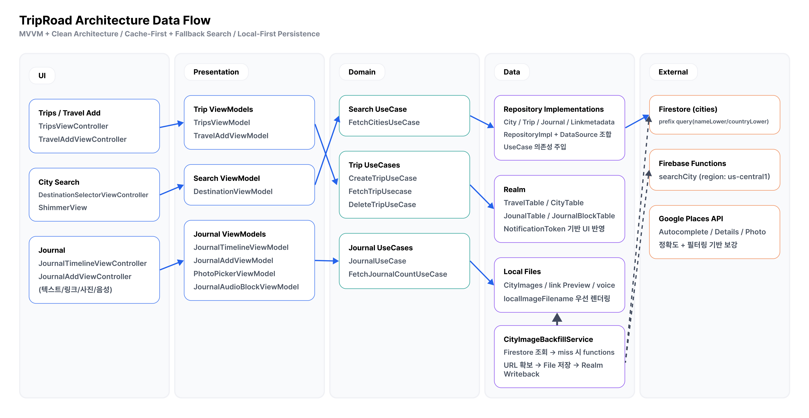

## 6. 핵심 기술 포인트
### 1) 도시 검색 하이브리드 구조
- 기술 목표: 검색 속도/정확도/API 비용 균형
- 설계/구현: Firestore prefix 1차 검색, miss 시 Functions fallback, `place_id` 기준 저장
- 핵심 포인트: cache-first 파이프라인으로 원격 호출 최소화

### 2) 링크 미리보기 파이프라인
- 기술 목표: 실시간 입력 기반 미리보기에서 동일 URL의 메타데이터 반복 요청을 줄이고, 다양한 입력 형태의 URL을 일관된 기준으로 판별
- 설계/구현: scheme 보정, host 소문자화, trailing slash/fragment/tracking query 제거, 문장 내 URL 추출 후 정규화 URL 기준 메모리 캐시 조회. 캐시에 없을 때만 `LPMetadataProvider`로 title/description/image를 요청하고, 대표 이미지가 없거나 로드에 실패하면 `iconProvider`를 fallback으로 처리
- 핵심 포인트: title/description이 유효한 결과만 캐시해 네트워크 오류나 불완전한 응답 재사용을 방지하고, 저장된 메타데이터와 이미지는 Realm/Documents에 보관해 기록 조회 화면에서 재사용

### 3) 도시 이미지 백필 + 로컬 우선 렌더링
- 기술 목표: 과거 데이터/오프라인에서도 이미지 표시 일관성 유지
- 설계/구현: BackfillService에서 `Kingfisher cache/retrieveImage` 우선 시도 후, 실패 시 `Data` 직접 다운로드 fallback으로 로컬 파일 저장 및 Realm 갱신
- 핵심 포인트: `localImageFilename` 우선 렌더링으로 네트워크 의존도 축소

### 4) 커스텀 사진 선택기
- 기술 목표: 대량 사진 환경에서 초기 체감 속도와 스크롤 안정성 확보
- 설계/구현: 페이지네이션, 증분 렌더링, 저화질->고화질 2단계 로딩, LRU 썸네일 캐싱, `PHCachingImageManager` 기반 방향성 preheating
- 핵심 포인트: LRU 캐시는 이미 로드된 `UIImage` 재사용을 담당하고, `PHCachingImageManager` 기반 preheating은 곧 화면에 등장할 `PHAsset` 요청을 미리 준비하도록 역할 분리. 진행 방향은 45개, 반대 방향은 15개 범위로 제한

### 5) 음성 메모 안정화
- 기술 목표: 시스템 이벤트 상황에서도 녹음/재생 상태 안정성 확보
- 설계/구현: 오디오 세션 관리 계층의 단일 세션 제어 + 인터럽션/라우트 변경 대응
- 핵심 포인트: 오디오 세션 생명주기 명시적 제어로 블록 간 충돌 방지

### 6) 티켓 스캔 자동 인식 기능
- 기술 목표: 탑승권·승차권 사진 한 장으로 교통수단·출발지·도착지·일정을 자동으로 채워 여행 기록 작성의 입력 부담 감소
- 설계/구현: 온디바이스(Apple Vision)와 서버(Claude API)의 역할 분리. Vision은 OCR·바코드 인식으로 1차 마스킹을 담당하고, Claude API는 마스킹된 이미지에서 구조화된 여정 정보(교통수단/출발지/도착지/일시)만 추출. 커스텀 카메라 촬영 → Vision 인식 → 마스킹 이미지 생성 → Functions 경유 Claude API 호출 → JSON 파싱 후 폼 자동 반영
- 핵심 포인트: 온디바이스 1차 처리와 서버 구조화 추출의 역할 경계를 명확히 분리

### 7) Firebase App Check 백엔드 보호
- 기술 목표: 인증 없이 호출 가능한 공개 백엔드 엔드포인트를 통한 비용 남용 가능성 차단
- 설계/구현: `cityPhotoProxy` Cloud Function과 Firestore `cities` 컬렉션이 무단 접근에 노출돼 있던 것을 확인하고, Firebase App Check(iOS는 App Attest, 로컬 개발은 Debug Provider) 도입. Kingfisher 요청 경로와 그 fallback인 순수 URLSession 다운로드 경로 모두에 토큰 첨부
- 핵심 포인트: 기존 사용자 영향 없이 클라이언트 선배포 후 서버 강제(Enforce)를 켜는 단계적 롤아웃 설계

## 7. 고민한 점 (설계 의사결정)
### 1) 도시 검색 Fallback 설계
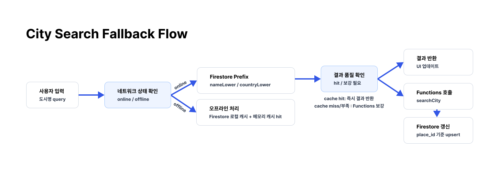
- 설계 목표: 검색 속도, 정확도, 비용의 균형
- 선택: `Firestore prefix cache-first -> miss 시 Functions fallback`
- 정책: 오프라인은 로컬 캐시만 사용, 온라인은 필요 시 원격 보강
- 기준: `place_id` 식별 일관성 유지, 1글자 입력 원격 호출 제한

### 2) 링크 메타데이터 정책
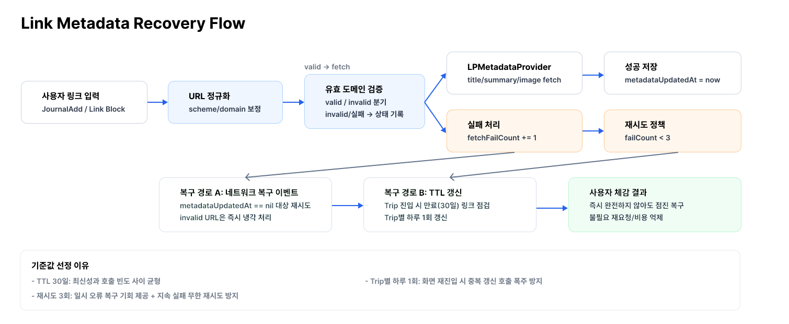
- 설계 목표: 누락 없이 저장하고, 과도한 재요청 방지
- 선택: 상태 필드(`metadataUpdatedAt`, `fetchFailCount`) 기반 복구 경로 분리
- 정책: 네트워크 복구 시 아직 메타데이터가 저장되지 않은 링크만 선별해 재시도
- 기준값: 실패 재시도 3회

### 3) 과거 데이터 호환성
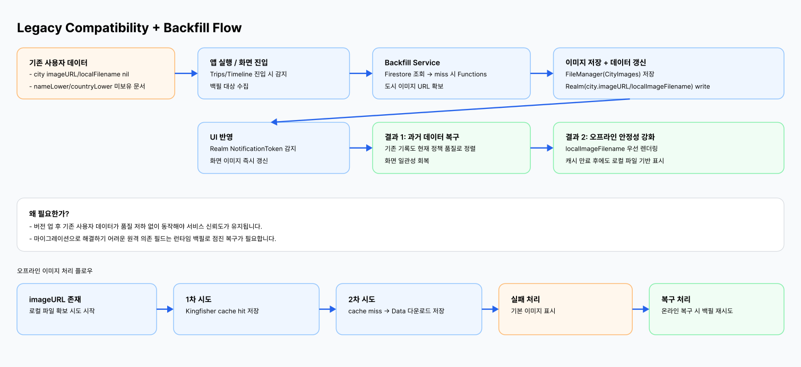
- 설계 목표: 스키마 변경 이후에도 기존 데이터 연속성 유지
- 선택: 하위호환 조회 + 이미지 누락 데이터 backfill
- 정책: 온라인 보강/오프라인 유지, 복구 후 로컬 파일 및 로컬 DB 재기록
- UI 반영: 로컬 DB 변경 감지 기반 즉시 갱신

### 4) 오디오 세션 안정성
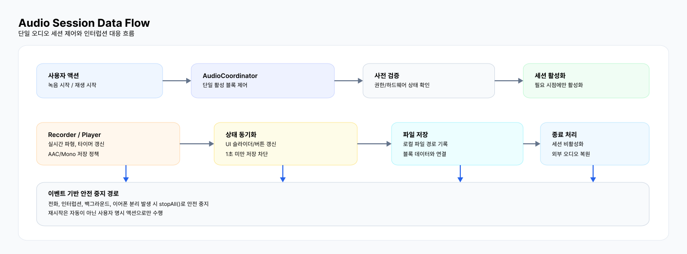
- 설계 목표: 인터럽션/라우트 변경 상황에서도 재현성 있는 동작
- 선택: 오디오 세션 관리 계층 중심의 단일 세션 제어
- 정책: 단일 활성 블록, 이벤트 발생 시 전체 오디오 작업 안전 중지
- 기준: 실제 녹음/재생 시점에만 세션 활성화, 1초 미만 저장 차단

### 5) 사진 선택기 로딩 전략 (AsyncStream)
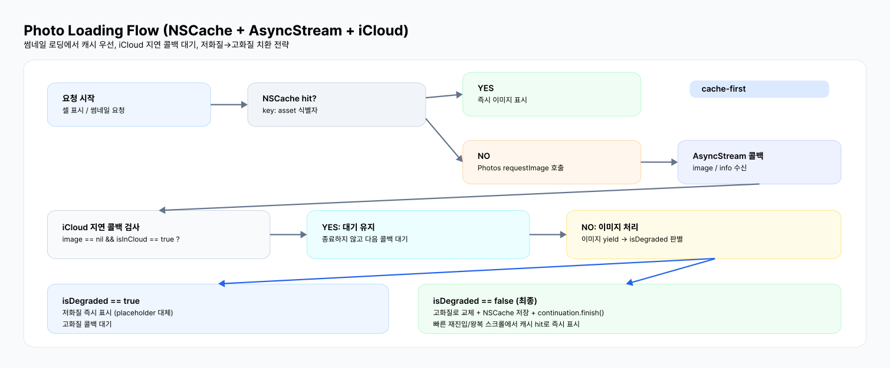
- 설계 목표: 초기 체감 속도와 최종 화질 동시 확보
- 선택: `AsyncStream` 저화질 -> 고화질 2단계 전달
- 선택 이유: 고화질 단건 로딩은 첫 화면 공백/지연이 커서, 저화질 즉시 표시 후 고화질 치환 방식으로 체감 성능과 최종 품질을 함께 확보
- 정책: iCloud 지연 콜백(nil) 대기 처리, 페이지네이션 + 증분 렌더링
- iCloud 처리 기준: `image == nil && isInCloud == true`는 실패가 아니라 다운로드 진행 상태로 보고 스트림을 종료하지 않음
- 기준: 대량 로딩 구간 전체 갱신 최소화, 증분 갱신 중심 렌더링, 셀 재사용 구간은 LRU 캐시 hit 우선 사용
- 성능 측정: 현재 LRU 캐시 + 방향 기반 preheating 구현 기준으로 Animation Hitches, Peak Memory, 재스크롤 cache hit 흐름 확인

### 6) 티켓 스캔 개인정보 보호 설계
- 설계 목표: 여정 정보 추출을 위해 티켓 사진을 외부 AI로 보내야 하는 상황에서, 사진에 함께 찍힌 여권번호·이름·생년월일·전화번호·좌석번호·바코드 같은 개인정보가 기능 목적과 무관하게 전송되지 않도록 방지
- 선택: 자동 마스킹 기술로 100%를 보장하려 하지 않고, 온디바이스 마스킹 + 사용자 확인을 필수 단계로 두는 다층 방어 구조 채택
- 정책: 사전 동의 → 온디바이스 자동 마스킹(Apple Vision) → 사용자 확인/보완(필수) → 서버 프롬프트 제약 → 서버 로그 마스킹 순으로 촬영 전부터 전송 이후까지 보호 장치 적용
- 기준: 탐지율을 높이는 문제가 아니라 탐지 실패를 전제로 안전망을 설계하는 문제로 접근, 판정 로직은 XCTest 13개로 검증

## 8. 트러블슈팅
### 1) 도시 검색 중복/오탐 데이터 유입
- 문제: query 기반 저장으로 Firestore에 중복/오탐 데이터가 누적됨
- 원인: 도시 식별 키와 필터 기준이 느슨해 동일 도시가 여러 문서로 저장됨
- 해결: `place_id`를 문서 키로 고정하고, 입력 정규화 + 도시 타입/국가 필터로 정상 도시만 저장
- 결과: 중복 문서 생성이 줄고 검색 결과 일관성이 개선됨

### 2) 링크 메타데이터 누락/반복 요청
- 문제: 실시간 입력 기반 링크 미리보기에서 동일 URL의 메타데이터 요청이 반복되거나, 오프라인/일시 오류로 미리보기가 누락될 수 있었음
- 원인: 입력 이벤트마다 LinkPresentation 요청 대상으로 다시 처리될 수 있고, 실패 상태를 구분하지 않으면 불완전한 응답 재사용 또는 과도한 재시도가 발생할 수 있었음
- 해결: 정규화 URL 기준 메모리 캐시를 추가하고, title/description이 유효한 결과만 캐시. 저장 이후에는 `metadataUpdatedAt`, `fetchFailCount`로 누락 링크를 구분해 네트워크 복구 시 최대 3회만 재시도
- 결과: 작성 화면의 중복 메타데이터 요청을 줄이고, 실패한 링크는 네트워크 복구 시 선별적으로 보완되도록 개선

### 3) 과거 데이터 도시 이미지 누락
- 문제: 스키마 확장 이전 데이터에는 이미지 URL·로컬 파일명이 없어 화면별 fallback 로직이 분산될 수 있었음
- 선택: 조회 시점 보정보다 backfill로 누락 데이터를 현재 스키마에 맞춰 저장하는 방식을 선택
- 구현: 캐시 조회 -> 직접 다운로드 -> 서버 보강 순으로 이미지를 복구하고, 로컬 파일 저장 후 DB 갱신
- 결과: 과거 데이터도 현재 이미지 정책으로 수렴시켜 도시 대표 이미지 표시 경로를 로컬 우선 흐름으로 통일

### 4) 사진 선택기 대량 로딩 크래시/깜빡임
- 문제: 기존에는 `NSCache`로 썸네일을 보관했지만, 대량 사진 선택기에서는 방금 지나온 구간을 다시 확인하는 사용 패턴이 많아 다시 볼 가능성이 높은 썸네일을 우선 남기는 정책이 필요했음
- 선택: `NSCache`는 시스템 메모리 상황에 따라 자동 정리되는 장점이 있지만, 어떤 이미지가 먼저 제거될지는 내부 정책에 의존함. 사진 그리드 탐색에서는 최근에 본 이미지를 다시 확인하는 흐름이 많아, 접근 순서 기준으로 오래 사용하지 않은 이미지를 우선 제거하는 LRU 캐시가 더 적합하다고 판단

- 구현: 사진 ID를 기준으로 썸네일 노드를 조회하고, 각 노드가 썸네일 이미지·메모리 비용·이전/다음 참조를 함께 보관하는 이중 연결 리스트 기반 LRU로 구성. 캐시 hit, 최근 접근 이동, 오래된 항목 정리를 O(1)로 처리하고, `PHCachingImageManager` preheating은 이전 범위와 새 범위의 차집합만 start/stop
- iCloud 예외 처리: `image == nil && isInCloud == true`는 실패로 종료하지 않고 다음 콜백 대기
- 결과: 동일 구간을 다시 스크롤할 때 다시 노출되는 이미지는 LRU 캐시에서 우선 재사용하고, 앞으로 노출될 영역은 방향 기반 preheating으로 미리 요청하도록 정리

```swift
// Before: iCloud 지연(nil) 콜백도 바로 종료되어 이미지 누락 가능
guard let image = image else { continuation.finish(); return }
continuation.yield(image)
```

```swift
// After: iCloud 지연 상태는 대기, 최종 콜백에서만 finish
let isInCloud = (info?[PHImageResultIsInCloudKey] as? Bool) ?? false
if image == nil && isInCloud { return }
if let image = image { continuation.yield(image) }
let isDegraded = (info?[PHImageResultIsDegradedKey] as? Bool) ?? false
if !isDegraded { continuation.finish() }
```

### 5) 음성 녹음/재생 세션 충돌
- 문제: 다중 음성 블록 및 인터럽션 상황에서 녹음/재생 상태 충돌
- 원인: 세션 활성/비활성 타이밍이 분산되어 이벤트 순서에 따라 상태가 꼬임
- 해결: 오디오 세션 관리 계층에서 녹음/재생 상태를 단일하게 제어하고, 인터럽션/라우트 변경 시 전체 오디오 작업을 안전 중지하도록 규칙화
- 결과: 예외 상황에서도 재현성 있는 동작으로 녹음/재생 안정성이 향상됨

```swift
// 핵심: 재생/녹음 시작 시점에만 세션 활성화
func activateAudioSession() -> Bool {
    let session = AVAudioSession.sharedInstance()
    do {
        try? session.setActive(false, options: [.notifyOthersOnDeactivation])
        try session.setCategory(.playback, mode: .default, options: [.defaultToSpeaker])
        try session.setActive(true)
        isAudioSessionActive = true
        return true
    } catch {
        return false
    }
}
```

### 6) 사진 속 개인정보가 외부로 그대로 전송될 위험
- 문제: 여정 정보 추출을 위해 티켓 사진을 외부 AI(Anthropic Claude API)로 보내야 하는데, 실제 티켓에는 여권번호·이름·생년월일·전화번호·좌석번호·바코드 같은 개인정보가 함께 찍혀 있어 기능 목적과 무관한 민감정보까지 전송될 위험이 있었음
- 원인: 여정 정보 추출 자체는 AI Vision 모델의 도움이 필요해, 사진 전체를 서버로 보내지 않으면 기능이 성립하지 않는 구조
- 해결: 사전 동의 → 온디바이스 자동 마스킹(Apple Vision) → 사용자 확인/보완(필수) → 서버 프롬프트 제약 → 서버 로그 마스킹으로 이어지는 5단계 방어선 설계. 판정 로직은 정규식·키워드 인접성 기반 순수 함수(`TicketPIIClassifier`)로 분리해 XCTest 13개로 검증. 초기 구현에서 발견된 오탐(단순 substring 비교로 "HOTEL"이 "TEL"에 걸리던 문제, 모든 날짜를 생년월일로 간주해 출발일·도착일까지 가려지던 문제)도 단어 경계 정규식과 키워드 인접성 기준으로 재설계해 수정
- 결과: 자동 마스킹의 탐지율을 높이는 문제가 아니라, 탐지 실패를 전제로 사용자 확인이라는 안전망을 필수 절차로 두는 구조로 재정의

### 7) Firebase App Check, 우회 가능한 절반짜리 방어
- 문제: 도시 사진을 대신 받아오는 `cityPhotoProxy` Cloud Function이 인증 없이 호출 가능한 공개 엔드포인트였고, Firestore `cities` 컬렉션도 공개 읽기 상태라 무단 호출을 통한 비용 남용 가능성이 있었음
- 원인: 함수 이름과 프로젝트 ID만 알면 외부에서 무제한 호출이 가능한 구조였고, App Check 토큰을 Kingfisher 요청 경로에만 붙였을 때는 그 경로가 실패했을 때 쓰이는 별도의 URLSession fallback 함수가 토큰 없는 요청을 그대로 보내고 있었음
- 해결: Firebase App Check(iOS는 App Attest, 로컬 개발은 Debug Provider) 도입 후, Kingfisher 경로와 URLSession fallback 경로 모두에 동일한 토큰 첨부 로직 적용. 서버 강제(Enforce)는 기존 사용자 업데이트 전 요청이 막히지 않도록 클라이언트 선배포 후 단계적으로 적용
- 결과: 실제 네트워크 요청이 나가는 코드 경로를 전부 추적해 빠짐없이 보호하도록 수정, 기존 사용자 영향 없는 단계적 롤아웃 확보

### 8) 해외 도시명 검색 누락
- 문제: "파리"처럼 마지막 글자가 "리"로 끝나는 해외 도시명이 검색 결과에서 통째로 빠짐
- 원인: 한국 행정구역 접미사(읍/면/동/리) 필터가 국가 구분 없이 모든 도시명에 적용되고 있었음
- 해결: 국가 필드가 대한민국/한국일 때만 접미사 필터를 적용하도록 조건 추가
- 결과: 해외 도시명이 한국 행정구역 접미사로 오인돼 필터링되는 문제 해소
