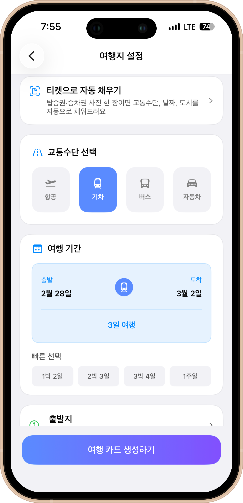
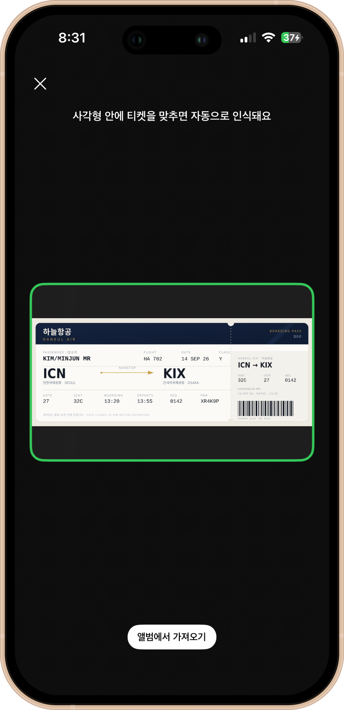
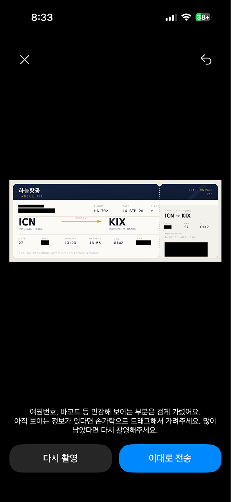

<h1 style="display: flex; align-items: center; gap: 8px;">
  
  TripRoad
</h1>


[](https://apps.apple.com/kr/app/triproad-%EC%97%AC%ED%96%89%EC%9D%98-%EC%88%9C%EA%B0%84%EC%9D%84-%EA%B8%B0%EB%A1%9D%ED%95%98%EB%8B%A4/id6753877753)
[](#기술-스택)
[](#기술-스택)

## 프로젝트 소개

TripRoad는 여행 준비, 기록 작성, 기록 조회를 하나의 흐름으로 연결한 iOS 여행 기록 앱입니다.

사용자는 여행 카드에 교통수단, 일정, 출발지, 도착지를 입력하고, 여행 중 남긴 텍스트, 링크, 사진, 음성 메모를 날짜별 타임라인으로 다시 확인할 수 있습니다. 여행 카드 생성 단계에서는 티켓 사진을 스캔해 교통수단, 출발지, 도착지, 일정을 자동 입력할 수 있습니다.

| 항목 | 내용 |
| --- | --- |
| 개발 기간 | `2025.09.29 ~ 지속 배포` |
| 프로젝트 유형 | 개인 프로젝트 |
| 플랫폼 | iOS 16.0+ |
| 배포 | App Store 배포 |
| 핵심 방향 | Local-first 저장, Firebase 보강, 대량 사진 최적화, AI 티켓 스캔, 개인정보 보호 |

## 목차

- [주요 기능](#주요-기능)
- [스크린샷](#스크린샷)
- [기술 스택](#기술-스택)
- [아키텍처](#아키텍처)
- [핵심 구현](#핵심-구현)
- [트러블슈팅](#트러블슈팅)
- [테스트](#테스트)

## 주요 기능

| 기능 | 설명 |
| --- | --- |
| 여행 카드 생성 | 교통수단, 출발지, 도착지, 날짜를 입력해 여행 단위 기록 생성 |
| 티켓 스캔 자동 입력 | 탑승권/승차권 사진에서 교통수단, 도시, 일정을 추출해 폼 자동 입력 |
| 도시 검색 | Firestore 캐시 우선 조회 후 Functions + Google Places API로 보강 |
| 블록형 여행 기록 | 텍스트, 링크, 사진, 음성 메모를 블록 단위로 저장 |
| 타임라인 조회 | 날짜 기준으로 기록을 그룹화하고 Realm 변경 감지로 즉시 갱신 |
| 커스텀 사진 선택기 | PhotoKit 기반 다중 선택, 페이지네이션, 저화질 -> 고화질 로딩 |
| 링크 미리보기 | URL 정규화 후 title/description/image 메타데이터 생성 및 재사용 |
| 음성 메모 | 녹음/재생, 단일 오디오 세션, 인터럽션/라우트 변경 대응 |
| 개인정보 보호 | 티켓 이미지 전송 전 온디바이스 마스킹, 사용자 확인, 서버 로그 마스킹 |

## 스크린샷

[](https://www.figma.com/design/VHvp2tvYlxKmvOAORLpNIs/TripRoad?node-id=0-1&t=43wVawkOv7NGf23r-1)

<table>
  <tr>
    <td align="center" width="25%">여행 목록</td>
    <td align="center" width="25%">여행지 설정</td>
    <td align="center" width="25%">도시 선택</td>
    <td align="center" width="25%">티켓 인식</td>
  </tr>
  <tr>
    <td align="center"></td>
    <td align="center"></td>
    <td align="center"></td>
    <td align="center"></td>
  </tr>
  <tr>
    <td align="center" width="25%">기록 목록</td>
    <td align="center" width="25%">기록 작성</td>
    <td align="center" width="25%">사진 선택</td>
    <td align="center" width="25%"></td>
  </tr>
  <tr>
    <td align="center"></td>
    <td align="center"></td>
    <td align="center"></td>
    <td align="center"></td>
  </tr>
</table>

## 기술 스택

| Category | Stack |
| --- | --- |
| Language | Swift 5 |
| UI | UIKit, SnapKit |
| Architecture | MVVM, Clean Architecture |
| Reactive / Async | RxSwift, RxCocoa, Swift Concurrency, AsyncStream |
| Local DB | RealmSwift |
| Backend | Firebase Firestore, Firebase Functions, Firebase App Check |
| AI / Vision | Apple Vision, Anthropic Claude API |
| Media | PhotoKit, PhotosUI, AVFoundation, LinkPresentation |
| Image / Utility | Kingfisher, FSCalendar, Toast-Swift, IQKeyboardManager |
| Functions | Node.js 24, TypeScript, firebase-functions |

## 아키텍처

TripRoad는 화면, 비즈니스 규칙, 데이터 접근 책임을 분리한 MVVM + Clean Architecture 구조입니다.

| Layer | 책임 |
| --- | --- |
| Presentation | ViewController, ViewModel, View, 사용자 입력 처리와 UI 상태 갱신 |
| Domain | Entity, UseCase, Repository Protocol, 앱 정책과 비즈니스 규칙 |
| Data | Realm, Firebase, Functions 호출, Repository 구현체, 외부 데이터 변환 |

## 핵심 구현

### 커스텀 사진 선택기

<table>
  <tr><th>구⁠분</th><th>내용</th></tr>
  <tr><td>목⁠적</td><td>기본 사진 선택기 대신 앱의 기록 작성 흐름에 맞춘 PhotoKit 기반 다중 선택기 구현</td></tr>
  <tr><td>처⁠리⁠ ⁠흐⁠름</td><td>사진 목록 페이지 로딩 -> 저화질 썸네일 우선 표시 -> 고화질 이미지 교체 -> 선택 상태 반영</td></tr>
  <tr><td>구⁠현⁠ ⁠포⁠인⁠트</td><td>선택 순서와 선택 개수 제한을 앱 내부 상태로 관리하고, 촬영 직후 라이브러리 변경을 즉시 반영</td></tr>
  <tr><td>성⁠능⁠ ⁠고⁠려</td><td>이미 불러온 썸네일은 LRU 캐시로 재사용하고, 스크롤 방향 기준으로 곧 보일 사진만 미리 요청</td></tr>
</table>

### 링크 미리보기

```text
URL 입력 -> 정규화 -> 메모리 캐시 확인 -> 메타데이터 요청 -> 유효한 결과만 저장
```

<table>
  <tr><th>구⁠분</th><th>내용</th></tr>
  <tr><td>목⁠적</td><td>같은 링크가 다른 문자열로 입력되어도 동일한 미리보기로 재사용</td></tr>
  <tr><td>정⁠규⁠화⁠ ⁠기⁠준</td><td>scheme 보정, host 소문자화, trailing slash 제거, fragment 제거, tracking query 제거</td></tr>
  <tr><td>캐⁠시⁠ ⁠정⁠책</td><td>정규화된 URL을 기준으로 캐시를 조회하고, 제목/설명이 유효한 결과만 저장</td></tr>
  <tr><td>복⁠구⁠ ⁠처⁠리</td><td>저장된 기록의 미리보기 누락 상태를 구분해 네트워크 복구 시 제한적으로 재시도</td></tr>
</table>

### 티켓 스캔 자동 입력



```text
티켓 촬영 -> 기기 내 OCR/마스킹 -> 사용자 확인 -> AI 분석 -> 도시/날짜/교통수단 변환 -> 폼 반영
```

<table>
  <tr><th>구⁠분</th><th>내용</th></tr>
  <tr><td>목⁠적</td><td>티켓 사진에서 여행 카드 생성에 필요한 교통수단, 도시, 일정을 자동 입력</td></tr>
  <tr><td>처⁠리⁠ ⁠분⁠리</td><td>기기에서는 OCR/바코드 인식과 개인정보 후보 마스킹, 서버에서는 마스킹된 이미지의 여정 정보만 추출</td></tr>
  <tr><td>데⁠이⁠터⁠ ⁠변⁠환</td><td>AI 응답을 그대로 저장하지 않고 앱 데이터 기준으로 도시, 날짜, 교통수단을 변환</td></tr>
  <tr><td>예⁠외⁠ ⁠처⁠리</td><td>매칭 실패나 불확실한 값은 전체 결과를 버리지 않고 사용자가 해당 필드만 수정 가능하도록 처리</td></tr>
</table>

### 음성 메모 안정화

<table>
  <tr><th>구⁠분</th><th>내용</th></tr>
  <tr><td>목⁠적</td><td>여행 기록에 음성 블록을 추가하고, 녹음/재생 상태를 예측 가능하게 관리</td></tr>
  <tr><td>세⁠션⁠ ⁠제⁠어</td><td>녹음과 재생 시작 시점에만 오디오 세션을 활성화하고, 하나의 작업만 실행되도록 제어</td></tr>
  <tr><td>시⁠스⁠템⁠ ⁠대⁠응</td><td>전화 수신, 이어폰 분리, 오디오 경로 변경, 백그라운드 진입 시 현재 상태를 정리</td></tr>
  <tr><td>저⁠장⁠ ⁠기⁠준</td><td>1초 미만 녹음은 유효한 기록으로 저장하지 않아 실수 입력을 줄임</td></tr>
</table>

### 백엔드 보호

<table>
  <tr><th>구⁠분</th><th>내용</th></tr>
  <tr><td>목⁠적</td><td>도시 검색과 이미지 프록시처럼 비용이 발생할 수 있는 백엔드 호출 보호</td></tr>
  <tr><td>구⁠현⁠ ⁠포⁠인⁠트</td><td>Firebase App Check를 적용해 앱에서 발급된 토큰이 있는 요청만 처리</td></tr>
  <tr><td>기⁠대⁠ ⁠효⁠과</td><td>외부에서 백엔드 엔드포인트를 직접 호출해 비용을 유발하는 위험 완화</td></tr>
</table>

## 트러블슈팅

### 1. 티켓 스캔 개인정보 보호

<table>
  <tr><th>구⁠분</th><th>내용</th></tr>
  <tr><td>문⁠제</td><td>티켓 자동 입력에는 AI 분석이 필요하지만, 실제 티켓에는 이름, 여권번호, 예약번호, 생년월일, 좌석번호, 바코드처럼 기능 목적과 무관한 개인정보가 함께 포함될 수 있었습니다.</td></tr>
  <tr><td>고⁠민</td><td>원본 이미지를 그대로 전송하면 불필요한 개인정보까지 함께 넘어갈 수 있었습니다. 다만 OCR 정확도, 티켓 언어, 레이아웃, 티켓 종류 차이 때문에 자동 탐지만으로 모든 개인정보를 잡아낸다고 가정할 수는 없었습니다.</td></tr>
  <tr><td>해⁠결</td><td>촬영 전 동의를 받고, 기기 안에서 OCR/바코드 인식으로 개인정보 후보를 먼저 마스킹했습니다. 이후 사용자가 마스킹 결과를 직접 확인하고 필요한 영역을 추가로 가릴 수 있는 확인 화면을 필수 단계로 넣었습니다. 서버 요청과 로그에서도 여정 정보 외 데이터가 남지 않도록 한 번 더 제한했습니다.</td></tr>
  <tr><td>결⁠과</td><td>기능 구현의 초점을 "탐지율 100%"가 아니라 "탐지 실패를 전제로 한 안전망"으로 바꿨습니다. 개인정보 후보 판정은 단위 테스트로 분리해 여권번호, 예약번호, 전화번호, 이름/생년월일/좌석 키워드 인접성, substring 오탐을 검증했습니다.</td></tr>
</table>

### 2. 티켓 장소 정보를 도시명으로 보정

<table>
  <tr><th>구⁠분</th><th>내용</th></tr>
  <tr><td>문⁠제</td><td>AI가 `ICN`, `GMP` 같은 공항 코드나 `동대구역`, `동부 터미널` 같은 역/터미널명을 그대로 반환할 수 있었습니다. 하지만 여행 카드에는 장소 시설명이 아니라 해당 장소가 위치한 도시가 들어가야 했습니다.</td></tr>
  <tr><td>고⁠민</td><td>앱에서 모든 공항 코드와 터미널명을 직접 매핑하면 유지보수 범위가 커집니다. 반대로 AI 응답만 신뢰하면 `ICN -> 인천`, `GMP -> 서울`, `동대구역 -> 대구`처럼 도시 단위 보정이 필요한 케이스를 놓칠 수 있었습니다.</td></tr>
  <tr><td>해⁠결</td><td>서버 요청 단계에서 공항 코드, 역 이름, 터미널명이 보이더라도 최종적으로는 해당 장소가 위치한 도시를 반환하도록 제한했습니다. 앱에서는 반환된 도시명을 국가 힌트와 함께 기존 도시 검색 흐름에 다시 넣어 실제 도시 데이터와 매칭했습니다.</td></tr>
  <tr><td>결⁠과</td><td>티켓의 장소 표현이 공항 코드나 역/터미널명이어도 여행 카드에는 도시 단위의 출발지/도착지가 들어가도록 정리했습니다. 국가 힌트 기반 도시 후보 선택은 단위 테스트로 검증했습니다.</td></tr>
</table>

### 3. 링크 미리보기 반복 요청과 누락

<table>
  <tr><th>구⁠분</th><th>내용</th></tr>
  <tr><td>문⁠제</td><td>사용자가 링크를 입력할 때마다 미리보기 메타데이터 요청이 반복될 수 있었고, 일시적인 네트워크 실패가 발생하면 저장된 기록에서도 미리보기가 비어 보일 수 있었습니다.</td></tr>
  <tr><td>고⁠민</td><td>같은 링크라도 `https` 유무, 대소문자, 마지막 slash, tracking query에 따라 다른 문자열로 들어올 수 있어 단순 문자열 비교로는 같은 링크를 안정적으로 판단하기 어려웠습니다. 또한 실패 응답까지 캐시하면 잘못된 미리보기를 계속 재사용할 위험이 있었습니다.</td></tr>
  <tr><td>해⁠결</td><td>요청 전에 URL을 정규화하고, 정규화된 URL을 기준으로 캐시를 조회했습니다. 제목과 설명이 유효한 결과만 캐시에 저장했고, 저장된 기록 중 미리보기가 누락된 항목은 네트워크 복구 시 실패 횟수 제한을 두고 다시 시도했습니다.</td></tr>
  <tr><td>결⁠과</td><td>동일 링크 재입력 시 기존 제목, 설명, 이미지를 즉시 재사용할 수 있게 되었고, 네트워크 실패로 누락된 미리보기는 무한 재시도 없이 선별적으로 복구하도록 정리했습니다.</td></tr>
</table>

### 4. 사진 선택기 캐싱 전략

<table>
  <tr><th>구⁠분</th><th>내용</th></tr>
  <tr><td>문⁠제</td><td>초기 사진 선택기에서는 썸네일 캐싱에 시스템 캐시를 사용했습니다. 하지만 대량 사진을 탐색할 때 사용자가 방금 지나온 구간을 다시 보거나 인접한 사진을 오가며 비교하는 흐름이 많았습니다.</td></tr>
  <tr><td>고⁠민</td><td>시스템 캐시는 구현이 단순하지만 제거 기준을 직접 제어하기 어렵습니다. 사진 그리드처럼 최근 본 이미지를 다시 볼 가능성이 높은 화면에서는 오래 보지 않은 이미지부터 제거하는 명확한 정책이 필요하다고 판단했습니다.</td></tr>
  <tr><td>해⁠결</td><td>썸네일 캐싱을 LRU 방식으로 변경했습니다. 사진 ID를 기준으로 이미지를 찾고, 캐시에 hit된 이미지는 최근 사용 항목으로 갱신했습니다. 캐시 개수나 메모리 비용이 기준을 넘으면 오래 접근하지 않은 이미지부터 제거했습니다.</td></tr>
  <tr><td>결⁠과</td><td>사진 로딩을 "이미 받아온 이미지 재사용"과 "곧 볼 사진 준비"로 나눠 관리할 수 있게 됐습니다. 단순 캐시 적용보다 대량 사진 탐색의 재방문 패턴에 맞춘 제거 정책을 직접 설계했다는 점을 강조했습니다.</td></tr>
</table>

### 5. 음성 메모 세션과 라우트 변경 처리

<table>
  <tr><th>구⁠분</th><th>내용</th></tr>
  <tr><td>문⁠제</td><td>여러 음성 블록에서 녹음과 재생이 동시에 발생하거나, 전화 수신/이어폰 분리/백그라운드 진입 같은 시스템 이벤트가 들어오면 오디오 상태가 꼬일 수 있었습니다.</td></tr>
  <tr><td>고⁠민</td><td>오디오 세션을 화면 진입 시점부터 계속 활성화하면 다른 앱 오디오와 충돌할 수 있고, 각 음성 블록이 독립적으로 세션을 관리하면 어떤 블록이 현재 권한을 갖는지 불명확해집니다.</td></tr>
  <tr><td>해⁠결</td><td>녹음이나 재생이 실제로 시작되는 시점에만 오디오 세션을 활성화했습니다. 새 음성 블록이 동작을 시작하면 기존 블록은 정리하고, 인터럽션이나 오디오 경로 변경이 발생하면 현재 작업을 안전하게 중지하도록 했습니다.</td></tr>
  <tr><td>결⁠과</td><td>다중 음성 블록 환경에서도 하나의 오디오 작업만 활성화되도록 제어했고, 시스템 이벤트 이후에도 사용자가 예측 가능한 상태로 돌아올 수 있게 했습니다.</td></tr>
</table>

## 테스트

네트워크나 Realm에 직접 의존하지 않는 순수 로직을 중심으로 단위 테스트를 구성했습니다.

| 테스트 대상 | 검증 내용 | 테스트 수 |
| --- | --- | ---: |
| URL 정규화 | URL 보정, query 제거, fragment 제거, 도메인 검증 | 7 |
| 링크 미리보기 캐시 | 유효 메타데이터 캐싱, 빈 응답 미캐싱, 오래된 항목 제거 | 5 |
| 티켓 개인정보 후보 판정 | 여권번호, PNR, 전화번호, 키워드 인접성, substring 오탐 방지 | 14 |
| 티켓 스캔 결과 변환 | 응답 데이터 변환, 필수값 검증, 날짜 파싱, 교통수단 매핑 | 8 |
| 티켓 스캔 오류 매핑 | Firebase Functions 오류 코드와 앱 오류 매핑 | 6 |
| 티켓 스캔 오류 메시지 | 사용자 표시 메시지 생성 | 3 |
| 스캔 도시 후보 선택 | 국가 힌트 기반 도시 후보 선택 | 5 |

주요 단위 테스트는 총 48개입니다. UI Test에서는 앱 실행, launch performance, 여행 생성 성공/실패 플로우를 확인합니다.
